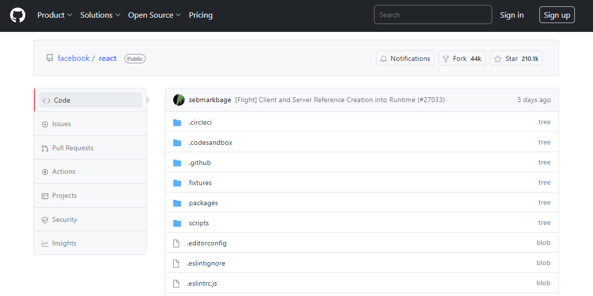

<div align="center"></div>

### <p align="center" style="font-size: 22px"><b>React GitHub Clone</b></p>

<p align="center"><a target="_blank" href="https://react-github-clone-gray.vercel.app/search/nodejs">DEMO</a></b></p>

#

<p align="center">Simplified Github Clone built with React and Apollo/GraphQL</p><br>

<div align="center"></div></br>

# About

A simplified and working clone of the popular version control platform, <b>GitHub</b>, using React library and Apollo Graphql.

I work as a frontend developer, and I have created this showcase product during my free time. It serves as modern react codebase that reflects real-world practices.

## Features

- Written in `React JS`/ `TypeScript`.
- The repositories are queried using `Apollo client` from `GitHub GraphQL API`.
- `Redux Toolkit` is used for global state management.
- The UI is styled using `Bootstrap 5`.
- Scalable and easy to understand project structure.
- Users can search and view GitHub repositories through it. Demo

## Installation

1. Get a free GitHub API Key from https://github.com/
2. Clone the repo

```bash
  git clone https://github.com/simon-kiros/react-github-clone.git
```

3. Install NPM packages

```bash
  cd react-github-clone
  npm install
```

4. Rename the `.env.example` to `.env` and update the `VITE_GITHUB_API_KEY` with your github api key.
5. Run the project

```bash
  npm run dev
```

## Contributing

Any contributions you make are <b>greatly appreciated</b>.
If you have a suggestion that would make this better, please fork the repo and create a pull request.

1. Fork the Project
2. Create your Feature Branch (`git checkout -b feature/NewFeature`)
3. Commit your Changes (`git commit -m 'Add some NewFeature'`)
4. Push to the Branch (`git push origin feature/NewFeature`)
5. Submit a pull request :D

## License

[MIT](https://choosealicense.com/licenses/mit/)

## Author

- [@simon-kiros](https://www.github.com/simon-kiros)

  simonkiros007@gmail.com
